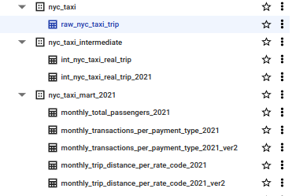

# NYC Taxi Analysis

Taxis are one of the most commonly found and used vehicles in New York. The large number of taxi uses makes taxi companies have to control and analyze their taxis in order to get maximum profit.

## Dataset
[NYC Taxi Trip](https://www.kaggle.com/datasets/anandaramg/taxi-trip-data-nyc/data) from Kaggle.

### Columns Description

| Columns | Description |
| ------------- | ------------- |
| lpep_pickup_datetime  | The date and time when the meter was engaged  |
| lpep_dropoff_datetim  | The date and time when the meter was disengaged  |
| passenger_count | The number of passengers in the vehicle |
| trip_distance | The elapsed trip distance in miles reported by the taximeter |
|  PULocationID |  TLC Taxi Zone in which the taximeter was engaged |
| DOLocationID | TLC Taxi Zone in which the taximeter was engaged |
|  RatecodeID | The final rate code in effect at the end of the trip  |
|  fare_amount | The time-and-distance fare calculated by the meter  |
| trip_type | Type of trip |
| payment_type | A numeric code signifying how the passenger paid for the trip |
| extra | Miscellaneous extras and surcharges. Currently, this only includes the $0.50 and $1 rush hour and overnight charges |
| mta_tax | $0.50 MTA tax that is automatically triggered based on the metered rate in use |
| tip_amount | This field is automatically populated for credit card tips. Cash tips are not included |
| tolls_amount | Total amount of all tolls paid in trip |
| improvement_surcharge | $0.30 improvement surcharge assessed trips at the flag drop. The improvement surcharge began being levied in 2015 |
| congestion_surcharge | Total amount collected in trip for NYS congestion surcharge |
| total_amount | The total amount charged to passengers. Does not include cash tips |

This dataset assumed located in Google Bigquery in [GCP Project].nyc_taxi.raw_nyc_taxi_trip

## Goals
Build data mart to provide requirements from business team :
- Monthly total passengers
- Monthly transactions per payment type
- Monthly trip distance per rate code

## Tools
- Airflow : Data pipeline orchestration
- Dbt : Data transformation
- BigQuery : Data Warehouse

## Data Warehouse Layers
1. Staging  
Data raw NYC taxi trip 
2. Intermediate  
Cleaning data raw NYC taxi trip from suspicious data record. The data trip must record :
- Number of passengers and must carry passenger
- Type of payment
- The trip distance and the taxi meter must be recorded properly
- Total amount paid must be equal to the sum of the taxi fees (fare_amount + extra + mta_tax + tip_amount + tolls_amount + improvement_surcharge + congestion_surcharge)
3. Data Mart  
Tables to achieve business team goals

## Steps
1. Make data transformation to create data warehouse layers (staging, intermediate, data mart) with test scripts.  

2. Make data workflow with airflow  

